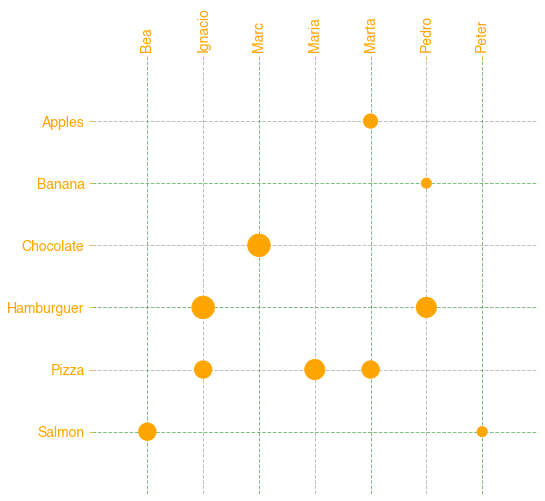

# Catscatter
*Scatter visualization for categorical features with matplotlib.*


## Context 🤔
I work as a Data Analyst using a bit of Data Science and a lot of Data Visualization. Last December, a coworker gave me for Christmas the book ["Knowledge is Beautiful"](https://informationisbeautiful.net/2014/knowledge-is-beautiful/) which I loved. It's **Data Visualizations are amazing** and really complex. I like to read it when I want to get inspired.

At the same time I work for a [VC fund](https://kfund.co/), where frameworks and **relationships are really important**. Showing relationships between categorical variables is not always an easy thing due to their "string" nature.

## Solution 💡
These two situations motivated me to create and use a *catscatter* function that is based in scatter plots relationships but uses categorical variables in a beautiful and simple way. Actually, the visualization is closer to an *adjacency matrix* than to a *scatter plot*: we are **not interested in where the markers are to find correlations but on which categories are connected to each other**, or which ones are more connected to something than to something else. It can be seen as a kind of *graph* relationship. To follow that relationship it is important to not only plot the markers in the intersections but to draw vertical and horizontal lines in the background.

## Development :gear:
The function is built for Python over Matplotlib and Pandas. The object is not closed so it can be initiated or changed by the user before and after.

## How to use it 👩‍💻

### Properties
- Input:

  + **df:** *pandas DataFrame, required.* pandas DataFrame with at least two columns with categorical variables you want to relate, and the value of both (if it's just an adjacent matrix create a column of 1s)
  + **colx:** *string, required.* The name of the column to display horizontally.
  + **coly:** *string, required.* The name of the column to display vertically.
  + **cols:** *string, required.* The name of the column with the value between the two variables.
  + **color:** *list, optional.* Colors to display in the visualization, the length can be two or three. The two first are the colors for the lines in the matrix, the last one the font color and markers color.
            *default ['grey','black']*
  + **ratio:** *float or int, optional.* A ratio for controlling the relative size of the markers.
            *default 10*
  + **font:** *string, optional.* The font for the ticks on the matrix.
            *default 'Helvetica'*
  + **save:** *bool, optional.* True for saving as an image in the same path as the code.
            *default False*
  + **save_name:** *string, optional.* The name used for saving the image (then the code ads .png)
            *default: "Default"*
- Output:

  + No output.

### Use example
- **Basic use**
```
import pandas as pd
import matplotlib as plt
from catscatter import catscatter

# example data frame
data=pd.DataFrame({'friend':['Peter','Marc','Ignacio','Marta','Marta','Ignacio','Maria','Pedro','Bea','Pedro'],
                  'favorite_food':['Salmon','Chocolate','Hamburguer','Pizza','Apples','Pizza','Pizza','Hamburguer','Salmon','Banana'],
                  'favorite_grade':[1,5,5,3,2,3,4,4,3,1]})

#plot it
catscatter(data,'friend','favorite_food','favorite_grade')
plt.show()
```


- **Personalized use**
```
import pandas as pd
import matplotlib as plt
from catscatter import catscatter

# example data frame
data=pd.DataFrame({'friend':['Peter','Marc','Ignacio','Marta','Marta','Ignacio','Maria','Pedro','Bea','Pedro'],
                  'favorite_food':['Salmon','Chocolate','Hamburguer','Pizza','Apples','Pizza','Pizza','Hamburguer','Salmon','Banana'],
                  'favorite_grade':[1,5,5,3,2,3,4,4,3,1]})

colors=['green','grey','orange']

#create the plot
plt.figure(figsize=(8,8))
catscatter(data,'friend','favorite_food','favorite_grade',color=colors,ratio=100)
plt.xticks(fontsize=14)
plt.yticks(fontsize=14)
plt.show()
```


- **Real use**

I created two poster size visualizations ([here](https://drive.google.com/file/d/1gAZbXTz5d8cpndob5QPH7ay3XkJIKopS/view) and [here](https://drive.google.com/file/d/1CkTdT7jDnZscqa6rY8xW569PX4NlvndG/view)) using *catscatter* with the most active Investors and Industries in the EU VC Investors Ecosystem.
